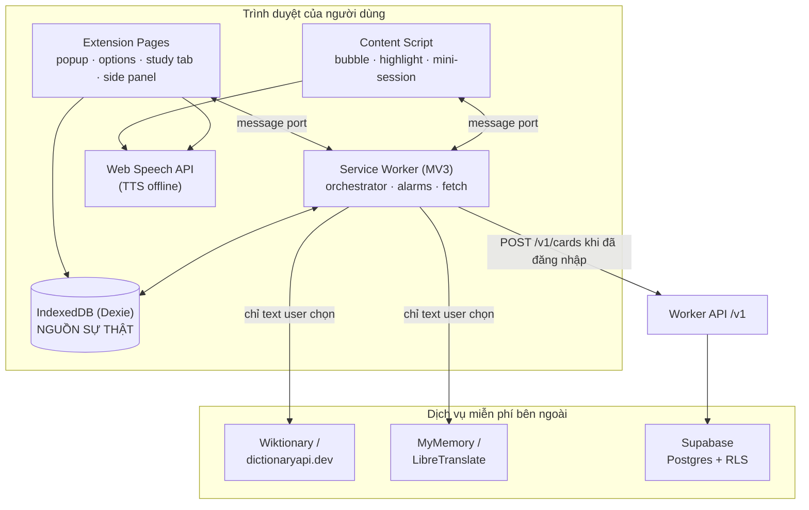
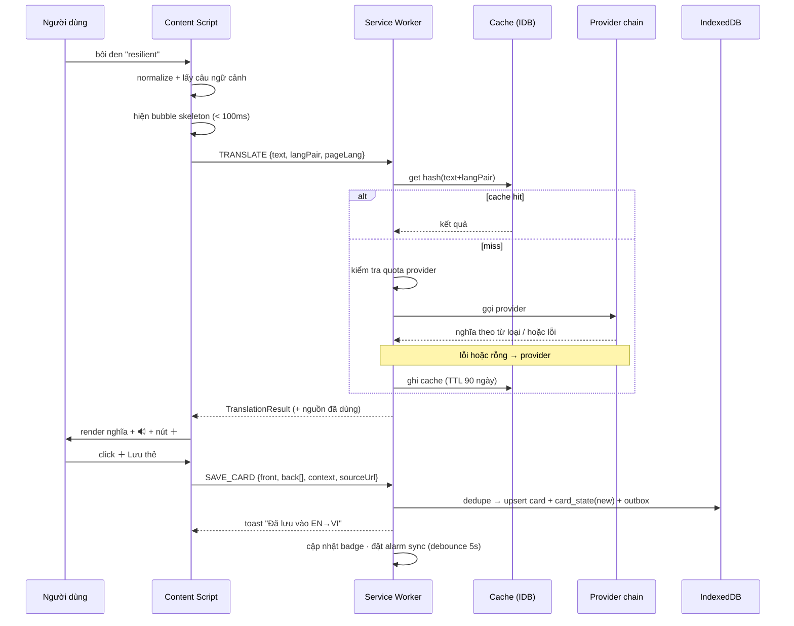
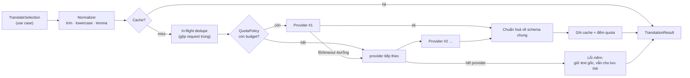

# Remember — Kiến trúc hệ thống

> Phiên bản: 0.1 (draft) · Ngày: 2026-08-31
> Đi kèm [REQUIREMENTS.md](REQUIREMENTS.md). Tài liệu này **chỉ mô tả kiến trúc**, không có code.
> Đồng bộ & tài khoản: [SYNC.md](SYNC.md). Nền tảng đa client (API + web PWA + Google SSO): [PLATFORM.md](PLATFORM.md).
> ⚠️ Mọi con số hạn mức free-tier là **ước lượng tại thời điểm viết** — phải kiểm tra lại trang giá của từng nhà cung cấp trước khi chốt.

---

## 1. Nguyên tắc kiến trúc

| # | Nguyên tắc | Hệ quả thiết kế |
|---|---|---|
| A1 | **Local-first — chỉ còn cho extension** (ADR-20) | Extension: IndexedDB là nguồn sự thật, rút server ra vẫn chạy đủ. **Web app: server là nguồn sự thật**, không có chế độ offline |
| A2 | **Domain thuần, hạ tầng cắm-rút** | Logic SRS / sync / dedupe không biết gì về `chrome.*`, HTTP hay Postgres; mọi thứ bên ngoài vào qua interface (port/adapter) |
| A3 | **Không có server của riêng mình cho phần cốt lõi** | Không cần API server để dịch hay để học. Backend chỉ làm auth + lưu trữ đồng bộ |
| A4 | **Mọi thao tác idempotent** | MV3 service worker có thể bị kill bất kỳ lúc nào; sync có thể chạy lại nhiều lần |
| A5 | **Quota là first-class citizen** | Provider dịch có budget/ngày, cache, và fallback chain — hiển thị được cho người dùng |
| A6 | **Dữ liệu người dùng ở mức tối thiểu** | Server không bao giờ nhận nội dung trang; chỉ nhận thẻ khi user bật sync |

---

## 2. Bộ công cụ miễn phí

### 2.1 Chọn stack

| Lớp | Lựa chọn | Vì sao | Giấy phép / hạn mức |
|---|---|---|---|
| Ngôn ngữ | **TypeScript** (strict) | chia sẻ domain giữa extension và web | free |
| Build extension | **Vite + @crxjs/vite-plugin** | HMR cho MV3, output cả Chrome & Firefox | MIT |
| UI | **React + Tailwind CSS** (+ Radix UI cho a11y primitives) | nhanh, a11y tốt, bundle kiểm soát được | MIT |
| Bubble in-page | React render trong **Shadow DOM** | CSS trang chủ không phá layout bubble | — |
| Local DB | **IndexedDB qua Dexie.js** | query index, transaction, migration rõ ràng | Apache-2.0 |
| SRS | **FSRS** (thư viện `ts-fsrs`) | chính xác hơn SM-2, có optimizer, chạy client | MIT |
| Charts | **Chart.js** hoặc **uPlot** | nhẹ, đủ cho stats/heatmap | MIT |
| Backend API | **Cloudflare Workers + Hono** — đường **duy nhất** tới DB (ADR-21) | client không cần `anon` key; rate-limit ở biên; đổi schema không phải ship extension | free: 100k req/ngày |
| Lưu trữ + auth | **Supabase free** (Postgres + GoTrue + RLS) | Worker gọi PostgREST; GoTrue cấp JWT cho client | free tier |
| Backend thay thế | **Cloudflare Workers + D1**, hoặc **PocketBase** self-host (Fly.io / Oracle Always Free) | tránh lock-in, dùng khi Supabase không phù hợp | free tier / MIT |
| Hosting web (dashboard, landing) | **Cloudflare Pages** hoặc **GitHub Pages** | static, băng thông rộng rãi | free |
| CI/CD | **GitHub Actions** | build, test, đóng gói zip extension, tạo release | free (rộng rãi với repo public) |
| Quản lý việc | **GitHub Issues + Projects** | | free |
| Test | **Vitest** (unit) + **Playwright** (E2E extension) | Playwright load được unpacked extension | MIT / Apache-2.0 |
| Lint/format | **ESLint + Prettier** (hoặc **Biome** cho gọn) | | MIT |
| Error tracking | **Sentry free**, hoặc **GlitchTip** self-host | opt-in, ẩn danh | free tier / AGPL |
| Analytics | **Umami** hoặc **Plausible CE** self-host | không cookie, opt-in | MIT / AGPL |
| Design | **Figma free** hoặc **Penpot** | | free |
| Tài liệu | Markdown trong repo (+ MkDocs Material [C]) | | free |

### 2.2 Nguồn dịch & từ điển (không cần thẻ tín dụng)

| Nguồn | Loại | Dùng cho | Lưu ý |
|---|---|---|---|
| **Wiktionary / Wikimedia REST API** | từ điển | định nghĩa, từ loại, etymology, audio (Wikimedia Commons) | không cần key, ToS thoáng nhất → **nên là nguồn định nghĩa chính** |
| **dictionaryapi.dev** (Free Dictionary API) | từ điển EN | định nghĩa, synonym/antonym, phiên âm IPA, audio | chỉ tiếng Anh, best-effort uptime |
| **MyMemory** | MT | dịch câu/cụm | free tier theo ngày, có/không email; cần tôn trọng rate limit |
| **LibreTranslate** | MT (open source) | dịch | instance công cộng hay giới hạn → **khuyến nghị self-host** cho ổn định |
| **Web Speech API** (`speechSynthesis`) | TTS | phát âm | **miễn phí, chạy offline, không key** → TTS mặc định |
| Tatoeba (dump) | câu ví dụ | ví dụ song ngữ | CC-BY, có thể đóng gói offline một phần |
| Proxy MT không chính thức (vd. Lingva) | MT | tuỳ chọn nâng cao | ⚠️ vùng xám ToS → **chỉ để user tự cấu hình, không bật mặc định** |

**Chuỗi ưu tiên (fallback chain) mặc định:**

```
Cache local (IndexedDB, TTL 90 ngày)
  → Wiktionary/dictionaryapi.dev  (nếu là 1 từ đơn → cần định nghĩa)
  → MyMemory                       (nếu là cụm/câu, hoặc từ điển không có kết quả)
  → LibreTranslate (endpoint user tự cấu hình)
  → Provider do user nhập key riêng (DeepL free key, Google key… nếu user có)
  → Lỗi mềm: hiện text gốc + nút "thử lại" + vẫn cho lưu thẻ (back để trống, sửa sau)
```

### 2.3 Hạn mức free-tier và cách sống trong đó

| Hạn mức (ước lượng) | Rủi ro | Thiết kế đối phó |
|---|---|---|
| Supabase free: DB ~500MB, project **tự pause khi không hoạt động** | sync dừng | app local-only vẫn chạy; cron ping nhẹ bằng GitHub Actions để giữ project sống; cảnh báo trong Diagnostics |
| Cloudflare D1 free: ~5GB, ~100k request/ngày | đủ rộng | batch sync (1 request cho N thay đổi) thay vì mỗi thẻ 1 request |
| API dịch free: vài nghìn lượt/ngày | hết quota giữa ngày | cache theo `hash(text + langpair)`, dedupe request đang bay, budget đếm/ngày cho từng provider, fallback chain |
| GitHub Actions phút build | ít khi tới hạn | chỉ build release trên tag; PR chỉ chạy lint + unit test |
| Chrome Web Store: **5 USD một lần** | không miễn phí | ship Firefox (AMO, free) + Edge (free) trước; Chrome khi cần |

**Ước lượng dung lượng:** 1 thẻ ≈ 0,6KB, 1 review_log ≈ 60B → 1.000 user × 1.000 thẻ + 20.000 log ≈ **~2GB**. Vượt free tier của Supabase → khi đó: (a) chỉ đồng bộ review_log tổng hợp theo ngày thay vì từng bản ghi, hoặc (b) chuyển sang D1/PocketBase self-host. **Ngưỡng cần quyết định: ~500 user active.**

### 2.4 Exit plan (chống lock-in)

Từ ADR-21, chỉ **một** thứ biết về Supabase: **Worker API**. Client chỉ biết `API_BASE_URL`.
Đổi Supabase sang D1/PocketBase = sửa Worker, **client không phải cập nhật** — đây chính là lợi ích
mà ADR-11 đã thiếu (extension không ép cập nhật được).

Trong Worker, tầng chạm DB nằm sau một interface:

```
pull(since: cursor) -> changes
push(changes) -> {accepted, serverTime, conflicts}
auth(): session
schemaVersion()
deleteAccount()
```

Đổi Supabase → D1/PocketBase = viết lại 1 adapter (~vài trăm dòng), schema SQL giữ nguyên (Postgres/SQLite tương thích ở mức DDL đơn giản). Domain, UI, local DB **không đổi một dòng**.

---

## 3. Kiến trúc tổng thể

### 3.1 Sơ đồ ngữ cảnh



**Quy tắc:** chỉ **service worker** được gọi mạng ra ngoài. Content script không tự fetch (tránh CORS, tránh lộ key, tập trung cache & quota một chỗ).

### 3.2 Phân lớp (hexagonal / ports & adapters)

```
┌──────────────────────────────────────────────────────────────┐
│ UI LAYER (React)                                             │
│  popup · options · study · deck browser · stats · bubble     │
│  – chỉ gọi Application Services, không chứa business rule    │
├──────────────────────────────────────────────────────────────┤
│ APPLICATION LAYER (use cases, TS thuần)                      │
│  TranslateSelection · SaveCard · BuildStudyQueue ·           │
│  GradeCard · RunSync · ImportDeck · ComputeStats             │
├──────────────────────────────────────────────────────────────┤
│ DOMAIN LAYER (TS thuần, không I/O — nơi có test dày nhất)    │
│  Card · Deck · Scheduler(FSRS) · Normalizer/Lemma ·          │
│  DedupePolicy · MergePolicy(conflict) · QuotaPolicy          │
├──────────────────────────────────────────────────────────────┤
│ PORTS (interface)                                            │
│  CardRepo · ReviewLogRepo · SettingsRepo · TranslationProvider│
│  · RemoteStore · Clock · Notifier · Speaker · Telemetry      │
├──────────────────────────────────────────────────────────────┤
│ ADAPTERS (chỗ duy nhất "biết" thế giới bên ngoài)            │
│  dexie-*  ·  provider-wiktionary / -mymemory / -libretranslate│
│  remote-supabase  ·  chrome-storage  ·  webspeech-speaker    │
└──────────────────────────────────────────────────────────────┘
```

Kiểm soát bằng lint rule về hướng import: `domain` không được import `adapters` hay `chrome.*`; `ui` không được import `adapters` trực tiếp.

### 3.3 Cấu trúc repo (monorepo, pnpm workspaces)

```
remember/
├── packages/
│   ├── domain/        # thực thể, FSRS wrapper, chính sách merge/dedupe/quota — 0 dependency runtime
│   ├── app/           # use case, orchestration, đọc/ghi qua ports
│   ├── data/          # Dexie schema + migration, repo impl, outbox
│   ├── providers/     # adapter dịch/từ điển + cache + quota meter
│   ├── sync/          # sync engine + adapter RemoteStore
│   └── ui/            # design system dùng chung (component, theme, i18n)
├── apps/
│   ├── extension/     # MV3: manifest, service worker, content script, các page
│   ├── web/           # web app ôn tập (PWA) — Cloudflare Pages
│   └── api/           # Worker /v1 (Hono) — đường duy nhất tới DB (ADR-21)
├── infra/
│   └── supabase/      # SQL migration, RLS policy (versioned, không click UI)
├── docs/              # REQUIREMENTS.md, ARCHITECTURE.md, ADR/
└── .github/workflows/ # ci.yml, release.yml
```

---

## 4. Kiến trúc extension (MV3)

### 4.1 Vai trò các thành phần

| Thành phần | Trách nhiệm | Không được làm |
|---|---|---|
| **Content script** (`document_idle`, inject theo `optional_host_permissions`) | phát hiện selection, dựng bubble trong Shadow DOM, vẽ highlight, chạy mini-session, trích context sentence | fetch mạng, chứa business logic, giữ state lâu dài |
| **Service worker** | router message, gọi provider, cache dịch, đếm quota, chạy `chrome.alarms` (sync, nhắc nhở, cập nhật badge), ghi IndexedDB | giữ state trong biến toàn cục (SW bị kill ~30s idle) |
| **Popup** | tra nhanh, tóm tắt số thẻ due, vào phiên học | công việc dài (dễ bị đóng giữa chừng) |
| **Study tab / side panel** | phiên ôn tập đầy đủ, deck browser, stats, settings | — |
| **Offscreen document** [S] | phát audio dài cho Playback mode (SW không phát được audio) | — |
| **Web worker** | FSRS optimizer, import lớn, tìm kiếm nặng | chặn UI |

### 4.2 Đối phó vòng đời service worker

- **Không** state trong biến module — mọi thứ ghi/đọc IndexedDB hoặc `chrome.storage.session`.
- Tác vụ dài (import, sync lớn) chia thành **job có checkpoint** trong bảng `jobs`; SW bị kill → lần chạy sau đọc checkpoint và tiếp tục.
- Định kỳ dùng `chrome.alarms` (tối thiểu ~1 phút), **không** `setInterval`.
- Message port dùng long-lived port cho phiên học đang mở, có heartbeat để phát hiện SW restart và tự reconnect.

### 4.3 Luồng "chọn text → thẻ" (sequence)



### 4.4 Highlight in-page — thiết kế hiệu năng

1. SW gửi cho content script một **bloom filter / Set các lemma** của thẻ trong cặp ngôn ngữ hiện tại (nén, cache theo tab) — không gửi cả bộ thẻ.
2. Content script quét text node theo lô (`TreeWalker` + `requestIdleCallback`), bỏ qua vùng loại trừ.
3. Tô sáng bằng **CSS Custom Highlight API** khi có (không sửa DOM → không phá trang, không làm layout reflow); fallback `<mark>` chỉ khi cần.
4. `MutationObserver` (throttle) cho nội dung tải động, có ngân sách thời gian: vượt ngân sách thì dừng và hiện "highlight tạm dừng (trang quá lớn)".

---

## 5. Mô hình dữ liệu

### 5.1 Local (IndexedDB / Dexie)

| Store | Khoá & index chính | Ghi chú |
|---|---|---|
| `cards` | `id` (UUIDv7); idx: `deckId`, `normalizedFront+langPair` (unique), `updatedAt` | nội dung thẻ; UUID sinh ở client → không cần server để tạo id |
| `card_states` | `cardId`; idx: `due`, `state`, `deckId+due` | tiến độ FSRS: `stability`, `difficulty`, `state`, `due`, `reps`, `lapses`, `lastReview` — **tách khỏi `cards`** vì tần suất ghi khác nhau và quy tắc merge khác nhau |
| `review_logs` | `id`; idx: `cardId`, `reviewedAt` | append-only, không sửa/xoá; nguồn cho stats + optimizer |
| `decks` | `id`; idx: `parentId` | |
| `translation_cache` | `hash`; idx: `expiresAt` | kết quả provider; dọn định kỳ |
| `settings` | `key` | 1 hàng/khoá, dễ merge từng field |
| `outbox` | `seq` (auto-inc) | thay đổi chờ push: `{entity, id, op, changedFields, clientTs}` |
| `tombstones` | `id` | `{entity, id, deletedAt}`, giữ 90 ngày |
| `jobs` | `id` | checkpoint tác vụ dài (import, sync, optimize) |
| `quota` | `providerId+date` | số lượt đã dùng trong ngày |

### 5.2 Remote (Postgres — Supabase)

```
profiles(id uuid pk → auth.users, settings jsonb, schema_version int)
decks(id uuid pk, user_id uuid, name, parent_id, updated_at timestamptz, deleted_at)
cards(id uuid pk, user_id uuid, deck_id uuid, front, back jsonb, lang_from, lang_to,
      reading, context_sentence, source_url, tags text[], note,
      normalized_front, updated_at, deleted_at)
card_states(card_id uuid pk, user_id uuid, state, due, stability, difficulty,
            reps, lapses, last_review, updated_at)
review_logs(id uuid pk, user_id uuid, card_id uuid, rating smallint,
            reviewed_at, elapsed_ms, scheduled_days)   -- append-only
sync_meta(user_id uuid pk, server_time, last_seq)
```

- **RLS bật trên mọi bảng**, policy `user_id = auth.uid()`. Từ ADR-21, client **không** nói trực tiếp với DB nữa — Worker là chốt duy nhất. RLS trở thành **lớp an toàn thứ hai** (ADR-22): Worker chuyển tiếp JWT của user nên một bug kiểu quên `where user_id` sẽ bị RLS chặn thay vì rò dữ liệu.
- `updated_at` do **trigger phía DB** đặt (`now()`), không tin đồng hồ client — chống lệch giờ máy user.
- Index: `(user_id, updated_at)` trên mọi bảng đồng bộ → pull delta bằng một range scan.
- Xoá = `deleted_at` (soft delete) + job dọn sau 90 ngày.

### 5.3 Bất biến (invariants) cần được test

1. Một `card` luôn có đúng một `card_state`.
2. `review_logs` không bao giờ bị sửa hay xoá bởi luồng sync.
3. `normalized_front + langPair` là duy nhất trong một user (dedupe).
4. Mọi thay đổi local sinh đúng một bản ghi `outbox` trong **cùng transaction** với thay đổi đó (không có "đã ghi nhưng chưa xếp hàng sync").
5. Sync chạy hai lần với cùng input cho kết quả giống hệt (idempotent).

---

## 6. Sync engine

> ⚠️ **Phạm vi đã thu hẹp sau ADR-20/21.** Web app là server-authoritative nên **không có** sync
> engine: mọi thay đổi đi thẳng qua API. Phần dưới đây chỉ còn áp dụng cho **extension**, và ở đó
> nó rút gọn còn **một chiều đẩy lên** (outbox) — không pull, không cursor, không tombstone,
> không merge. Giữ lại bản đầy đủ để tham chiếu nếu sau này quay lại local-first ở web.

### 6.1 Giao thức (delta, cursor-based)

```
PULL:  since = last_server_time (cursor lưu local)
       server trả các hàng có updated_at > since, theo trang (page size 500)
       → áp vào local qua MergePolicy → cập nhật cursor = server_time của lô

PUSH:  đọc outbox theo thứ tự seq, gom lô ≤ 200 thay đổi
       gửi kèm base_updated_at của từng hàng (optimistic concurrency)
       server trả {accepted[], conflicts[], server_time}
       → accepted: xoá khỏi outbox
       → conflicts: đưa vào MergePolicy, sinh outbox mới nếu local vẫn thắng
```

Chu trình: `PULL → merge → PUSH → PULL ngắn (xác nhận)`. Toàn bộ chạy trong một `job` có checkpoint.

### 6.2 Chính sách merge (thuộc DOMAIN, thuần, test được)

| Loại dữ liệu | Quy tắc | Lý do |
|---|---|---|
| Nội dung thẻ (`front`, `back`, `note`, `tags`) | **per-field LWW** theo `updated_at` server | sửa nội dung ít khi xung đột thật; per-field giảm mất mát |
| `tags` | union rồi trừ tombstone của tag | tránh mất tag khi 2 máy thêm tag khác nhau |
| `card_states` | thắng theo `last_review` **mới hơn** (không theo `updated_at`) | máy nào ôn sau thì tiến độ máy đó đúng hơn |
| `review_logs` | **append-only, union theo id** | không thể conflict |
| `settings` | per-key LWW | |
| Xoá | tombstone luôn thắng bản update cũ hơn `deletedAt` | chống "thẻ sống lại" |

Trường hợp không thể tự quyết (rất hiếm, ví dụ cả hai máy sửa `front` khác nhau trong cùng lô): giữ bản server, **lưu bản local vào `note`** kèm nhãn `[conflict]` — không bao giờ âm thầm mất dữ liệu người dùng.

### 6.3 Realtime [S]
Supabase Realtime để đẩy "có thay đổi mới" khi có ≥ 2 thiết bị đang mở → chỉ dùng làm **tín hiệu kích hoạt pull**, không phải kênh truyền dữ liệu (giữ một đường sync duy nhất, dễ debug).

---

## 7. Provider layer (dịch & từ điển)



**Schema kết quả chung** (mọi provider phải map về đây — UI chỉ biết schema này):

```
TranslationResult {
  source: 'dictionary' | 'mt'
  providerId, fetchedAt, fromCache
  detectedLang?
  primary: string
  senses: [{ pos?, gloss, examples[]?, synonyms[]?, antonyms[]? }]
  reading?           // IPA / phiên âm
  reverse?: string[] // dịch ngược
  audio?: { url? | useTts: true }
  license?           // ghi công nguồn (Wiktionary = CC BY-SA) — bắt buộc hiển thị
}
```

**Thêm provider mới = thêm 1 file adapter + 1 dòng cấu hình chain.** Không sửa UI, không sửa domain. Đây là điểm chống rủi ro lớn nhất của việc dựa vào API miễn phí.

**Chi tiết bắt buộc:** timeout 4s/provider; retry 1 lần với backoff cho lỗi 5xx/mạng, **không retry** lỗi 4xx; ghi công giấy phép nguồn (Wiktionary CC BY-SA) trong bubble và trên thẻ.

---

## 8. Vận hành & chất lượng

### 8.1 CI/CD (GitHub Actions, free)

| Workflow | Trigger | Việc |
|---|---|---|
| `ci.yml` | PR, push | typecheck · lint · unit test (Vitest) · build extension · kiểm tra **giới hạn kích thước bundle** (fail nếu content script > 60KB gzip) |
| `e2e.yml` | PR (nightly nếu chậm) | Playwright chạy Chromium với extension unpacked: cài → chọn text → lưu thẻ → ôn 1 thẻ |
| `release.yml` | tag `v*` | build zip cho Chrome/Firefox/Edge, sinh changelog, tạo GitHub Release; upload AMO qua `web-ext` (API key trong secrets) |
| `keepalive.yml` | cron ngày | ping Supabase để project free không bị pause |
| `db.yml` | thay đổi `infra/supabase/**` | apply migration bằng Supabase CLI (staging → prod) |

### 8.2 Chiến lược test

| Tầng | Công cụ | Trọng tâm | Ngưỡng |
|---|---|---|---|
| Domain | Vitest | FSRS scheduling (bao gồm biên: giờ bắt đầu ngày, múi giờ, DST), dedupe, MergePolicy, QuotaPolicy | coverage ≥ 80%, nhánh merge phải phủ 100% |
| Sync | Vitest + fake RemoteStore | **kịch bản xung đột**: offline hai máy, xoá vs sửa, kill giữa sync, chạy lại 2 lần | mọi bất biến §5.3 |
| Adapter provider | Vitest + fixture HTTP đã ghi lại | map response → schema chung, xử lý lỗi/rỗng | mỗi provider ≥ 1 ca thành công + 3 ca lỗi |
| UI | Testing Library | bubble định vị/lật cạnh, phím tắt màn học | smoke |
| E2E | Playwright | J1 và J2 trong REQUIREMENTS §7 | phải xanh trước mỗi release |
| Hiệu năng | script bench | highlight 5k từ, danh sách 20k thẻ | NFR-2, NFR-3 |

### 8.3 Bảo mật & quyền riêng tư (thiết kế)

- Quyền: `activeTab` + `optional_host_permissions` — người dùng cấp domain khi cần, **không** xin `<all_urls>` lúc cài.
- Không remote code, không `eval` (MV3 CSP bắt buộc) → mọi thư viện bundle sẵn.
- Access token trong `chrome.storage.session` (bộ nhớ, mất khi đóng browser); refresh token trong `chrome.storage.local` — chấp nhận rủi ro và ghi rõ trong threat model.
- Phân quyền hai lớp: **Worker API** kiểm JWT và sở hữu, **RLS Postgres** là lưới an toàn thứ hai (ADR-22). Coi mọi request từ client là không tin cậy.
- **`anon` key và `service_role` không bao giờ có trong client** — chúng là `wrangler secret` của Worker (ADR-21).
- Không log nội dung thẻ hay text người dùng chọn vào Sentry (scrub trước khi gửi).
- Telemetry mặc định **tắt**; nếu bật: chỉ event ẩn danh (không id thiết bị bền, không nội dung).
- Trang privacy policy công khai (bắt buộc để lên store) sinh từ chính tài liệu này.

### 8.4 Migration & versioning
Local: Dexie version + hàm upgrade cho mỗi phiên bản, **có test upgrade từ mọi version đã phát hành**.
Remote: `schema_version` trong `profiles`; client cũ hơn server → chỉ đọc + nhắc cập nhật (không ghi sai schema).
Nguyên tắc: mọi thay đổi schema phải **tương thích ngược 1 phiên bản** (thêm cột nullable trước, xoá sau 1 release).

---

## 9. Quyết định kiến trúc (ADR ngắn)

| # | Quyết định | Thay thế đã cân nhắc | Lý do chọn |
|---|---|---|---|
| ADR-1 | ~~IndexedDB là source of truth, cloud là bản sao~~ **(thu hẹp bởi ADR-20: chỉ còn cho extension)** | server-first + cache | offline-first (G3), 0đ hạ tầng (G5), không có server sập là hết dùng. **Web app đã chuyển sang server-first — xem ADR-20** |
| ADR-2 | FSRS thay SM-2 | SM-2 (đơn giản hơn) | retention tốt hơn với cùng số lần ôn, có optimizer, thư viện MIT sẵn dùng |
| ADR-3 | ~~Không viết API server riêng; client → Supabase + RLS~~ **(bị thay thế bởi ADR-21)** | Node/Express + Postgres | Lý do cũ: ít thứ phải vận hành nhất, RLS đủ cho mô hình 1-user-1-hàng. **Lý do lật:** extension công khai không được chứa `anon` key — xem ADR-21 |
| ADR-4 | Provider dịch là plugin có fallback chain | gắn cứng 1 API | mọi API miễn phí đều có thể chết/đổi ToS — đây là rủi ro số 1 (REQUIREMENTS §9) |
| ADR-5 | TTS bằng Web Speech API | API TTS cloud | miễn phí thật, offline, không key, đủ chất lượng cho phát âm từ |
| ADR-6 | Chỉ service worker gọi mạng | content script tự fetch | tập trung cache/quota/secret; tránh CORS trên trang lạ |
| ADR-7 | `card_states` tách khỏi `cards` | một bảng gộp | tần suất ghi và quy tắc merge khác nhau; giảm xung đột sync |
| ADR-8 | Monorepo domain thuần TS | code trực tiếp trong extension | test nhanh không cần browser (NFR-10); tái dùng cho web app/mobile sau |
| ADR-9 | Ship Firefox trước | Chrome trước | AMO miễn phí → giữ chi phí 0đ; Chrome tốn 5 USD một lần |
| ADR-10 | Dùng endpoint **không chính thức** của Google Translate (`translate_a/single`) làm provider đầu chain | Cloud Translation API chính thức; chỉ Wiktionary + MyMemory | Là nguồn **duy nhất** trả về loại từ + nghĩa nhóm theo POS + dịch ngược + định nghĩa mà không cần key. API chính thức cần billing và chỉ trả bản dịch thuần. **Đổi lại:** ngoài ToS Google, có thể bị chặn bất kỳ lúc nào → bắt buộc giữ fallback chain và cho user đổi thứ tự provider (§2.2, §6.5) |
| ADR-11 | ~~**Không** dựng API trung gian cho SSO/DB ở v1~~ **(bị thay thế bởi ADR-13)**: client → PostgREST + RLS, đăng nhập bằng OTP email | Bridge API trên Cloudflare Workers; API riêng làm auth | RLS đã thực thi đúng thứ authorization của API sẽ làm (mô hình 1-user-sở-hữu-hàng-của-mình); GoTrue **đã là** auth server nên API không tạo ra SSO, chỉ proxy. Workers free = 100k req/ngày **cho toàn bộ user** ⇒ ~650 user là trần, cứng hơn trần 500MB của Supabase. **Đổi lại:** đổi schema/backend phải ship extension và chờ store review; `anon key` public nên không rate-limit được. Bù bằng: `remote.js` là điểm ghép duy nhất + `schema_version` để client cũ chỉ-đọc. Thêm API khi có deck chia sẻ, cần giấu key trả phí, hoặc bị lạm dụng quota |
| ADR-12 | Lời gọi dịch **luôn đi từ máy người dùng**, không bao giờ proxy qua server của mình | Proxy qua Workers để giấu/đổi provider tập trung | Proxy ⇒ một IP gọi thay cho tất cả user ⇒ Google chặn IP đó là **toàn bộ** hệ thống mất chức năng dịch cùng lúc. Phân tán IP là điểm mạnh của kiến trúc client-side |
| ADR-13 | **Có** API `/v1` trên Cloudflare Workers; thêm **web PWA luyện tập** và **Google SSO**. Thay thế ADR-11 | giữ client → PostgREST trực tiếp cho cả 3 client | Điều kiện kích hoạt đã nêu trong ADR-11 nay xảy ra: **3 client**, mà extension **không ép cập nhật được** ⇒ đổi schema là vỡ client cũ. API cho phép hạ cấp response theo `clientSchema` và rate-limit ở biên (thứ `002_quota.sql` không làm được). **Đổi lại:** thêm trần cứng 100k req/ngày ⇒ phải gộp pull+push vào **một** endpoint `/v1/sync`, nếu không trần rơi từ ~1.800 xuống ~500 user. Xem PLATFORM.md |
| ADR-14 | ~~**Web app chỉ luyện tập, không bắt từ**~~ **(bị lật bởi ADR-19 — tiền đề CORS sai)** | cho web app tra từ qua proxy ở Worker | Trang web **không gọi được** `translate.googleapis.com` (không có CORS header; extension bỏ qua được nhờ `host_permissions`) ⇒ buộc proxy ⇒ một IP gọi thay tất cả user ⇒ vi phạm ADR-12. Giải bằng cách **không cho web app cần đến nó**: ôn tập không cần dịch |
| ADR-15 | ~~Google SSO chạy duy nhất ở web app; extension nhận session qua `externally_connectable`~~ **(cách bàn giao token bị thay bởi ADR-28; phần "web là bề mặt xác thực duy nhất" vẫn giữ)** | `chrome.identity.launchWebAuthFlow` trong extension | `chromiumapp.org` redirect phụ thuộc **extension-id**, mà id đổi theo cách đóng gói (dev / unpacked / store = 3 id) ⇒ phải khai và bảo trì cả ba. Một bề mặt xác thực = một luồng OAuth. Vẫn khai `chromiumapp.org` làm đường lùi |
| ADR-16 | Mobile bằng **PWA**, không native | app native iOS/Android | 0đ, không phí store, không review, dùng chung `packages/domain`. **Đổi lại:** iOS push chỉ từ 16.4+ và chỉ khi đã cài home screen; storage có thể bị dọn ⇒ với web app, sync **không** là tuỳ chọn (khác extension) |
| ADR-17 | ~~Web app là **Vite + React SPA tĩnh**; API dùng **Hono** trên Workers~~ **(bị thay bởi ADR-24)** | Next.js (+ adapter Cloudflare); SvelteKit SSR; Remix | Toàn bộ dữ liệu là của riêng từng user và nằm sau đăng nhập, lấy từ API ở phía client ⇒ SSR không có gì để render sẵn. Deploy = đẩy thư mục tĩnh, không adapter/runtime. Cùng Vite với extension ⇒ một hệ build cho 3 client. Next.js dễ deploy nhất **trên Vercel**, nhưng Vercel Hobby cấm thương mại (PLATFORM §3) |
| ADR-18 | ~~Ở quy mô **cá nhân, repo công khai**: **bỏ API `/v1`**~~ **(bị thay thế bởi ADR-21)** và bỏ rate limit, quay về client → PostgREST + RLS; chặn lạm dụng bằng **tắt đăng ký** ở Supabase | giữ nguyên kiến trúc đầy đủ của ADR-13 | Lý do tồn tại của API là *không ép cập nhật extension được* — không áp dụng khi tự load extension của mình. Tắt đăng ký mạnh hơn captcha + quota cộng lại và là một toggle. **Điều kiện quay lại ADR-13:** mở đăng ký công khai, hoặc đưa extension lên store cho người lạ dùng. Xem PLATFORM §9 |
| ADR-19 | **Web app tra từ trực tiếp**, không proxy. Lật ADR-14 | giữ web app chỉ luyện tập | ADR-14 dựa trên tiền đề "endpoint dịch không trả CORS header" — **đo lại thì tiền đề sai**: `translate.googleapis.com/translate_a/single` trả `Access-Control-Allow-Origin: *` (cả preflight OPTIONS), `freedictionaryapi.com` phản chiếu Origin. Trang web gọi được trực tiếp ⇒ **ADR-12 vẫn nguyên vẹn**: mỗi user vẫn dùng IP của chính mình, không có proxy tập trung để Google chặn. `translate_tts` thật sự không có CORS, nhưng `<audio>`/`new Audio()` là request no-CORS nên vẫn phát được (chỉ không đọc được nội dung bằng JS — không cần) |
| ADR-20 | **Web app bỏ offline-first**: Supabase là nguồn sự thật, mỗi lượt chấm ghi thẳng lên server. Extension giữ local-first | giữ local-first + snapshot backup (phương án 3), hoặc sync delta đầy đủ | Quyết định của người dùng, ngày 2026-09-02. Đổi lấy: iOS dọn IndexedDB không còn là rủi ro, và **không cần sync engine** (không outbox/tombstone/cursor/merge) — giảm ~1 tuần công việc. **Cái mất, đã nêu trước khi quyết:** không học được khi mất mạng; mạng chập chờn làm lượt chấm thất bại phải thử lại; và **Supabase free pause sau 7 ngày ⇒ app chết hoàn toàn** thay vì chỉ mất sync ⇒ cron `keepalive()` từ "nên có" thành **bắt buộc**. Ghi thất bại = lượt chấm không xảy ra ⇒ UI phải chặn chấm tiếp cho tới khi ghi xong |
| ADR-21 | **Backend API là đường duy nhất tới DB.** Không client nào (extension, web) nói trực tiếp với Postgres/PostgREST. Thay thế ADR-18, xác nhận lại ADR-13 | client → PostgREST + RLS trực tiếp (ADR-11/18) | Quyết định của người dùng, 2026-09-02. Lợi ích quyết định: **`anon` key không còn nằm trong client** — nó thành secret của Worker ⇒ PostgREST không thể gọi tới nếu không có `apikey`. Đây là câu trả lời đúng cho vấn đề "extension public không giấu được kết nối DB": không phải giấu key, mà **bỏ nhu cầu client có key**. Kèm theo: rate-limit ở biên làm được, đổi schema không phải ship extension, `service_role` tồn tại an toàn phía server. **Đổi lại:** thêm một thứ phải vận hành và một trần quota (Workers 100k req/ngày) |
| ADR-22 | API **chuyển tiếp JWT của user** tới PostgREST thay vì dùng `service_role` cho mọi thứ | Worker dùng `service_role` và tự kiểm quyền | Giữ RLS làm **lớp an toàn thứ hai**: một bug trong Worker (quên `where user_id`) sẽ bị RLS chặn thay vì rò dữ liệu. `service_role` chỉ dùng cho việc thực sự cần vượt RLS (xoá tài khoản, job dọn dẹp) |
| ADR-23 | Client nói **trực tiếp với GoTrue** để đăng nhập (Google SSO qua `@supabase/supabase-js`, flow PKCE) — nên **`anon` key vẫn có trong client, chỉ cho auth** | proxy cả auth qua Worker (`/v1/auth/google/start` + callback), Worker giữ anon key và đặt httpOnly cookie | GoTrue **bắt buộc** header `apikey` ⇒ nói chuyện trực tiếp thì client phải có anon key. ADR-21 ("client không biết anon key") vì vậy **chỉ đạt được phần dữ liệu**, chưa đạt phần auth. Chấp nhận vì: `001_init.sql` đã `revoke all … from anon` ⇒ key đó không đọc-ghi được gì, và tắt đăng ký công khai ⇒ không tạo tài khoản hàng loạt được. GoTrue là auth server, không phải DB, nên không vi phạm tinh thần ADR-21. **Đường nâng cấp:** proxy auth qua Worker — chỉ sửa `web/src/auth.js`, đồng thời cho phép httpOnly cookie thay vì token trong localStorage |
| ADR-24 | **Next.js App Router trên Vercel**, backend là **Route Handlers `app/api/v1/*`** trong cùng project. Thay thế ADR-17 và thay Workers/Hono | Vite SPA + Hono Worker riêng (2 deploy); Next.js trên Cloudflare qua OpenNext | Quyết định của người dùng, 2026-09-02. Lý do loại Next.js ở ADR-17 (Vercel Hobby cấm thương mại) **không còn áp dụng** vì dùng cá nhân. Được thêm: **cùng origin ⇒ không cần CORS cho web**, một lần deploy, một bộ env, và auth server-side thành mặc định. Tách frontend/backend được **cưỡng chế bởi build**: `import 'server-only'` làm build fail nếu client component chạm vào code server; env không có `NEXT_PUBLIC_` không bao giờ vào bundle client. **Đổi lại:** phụ thuộc Vercel; nếu về sau thương mại hoá thì phải lên Pro hoặc chuyển backend sang Workers — route handler viết mỏng nên chuyển được |
| ADR-25 | Auth **hoàn toàn server-side**: `/api/v1/auth/login` + `/callback` đặt **httpOnly cookie**. Đóng lỗ hổng ADR-23 | giữ `@supabase/supabase-js` chạy trong browser với anon key + token trong localStorage | Với route handler, server giữ anon key và tự đổi `?code=` lấy session ⇒ **browser không còn cần anon key, cũng không giữ token ở localStorage** (XSS không đọc được cookie httpOnly). Đây đúng là "đường nâng cấp" đã ghi trong ADR-23, và với Next.js nó là mặc định chứ không phải việc thêm. **Extension vẫn dùng Bearer token** — cookie không gửi được từ origin `chrome-extension://`, nên backend phải nhận cả hai (cookie trước, rồi Bearer) |
| ADR-26 | **Tính FSRS ở server**, không ở client. Client chỉ gửi `{cardId, rating, answeredAt}` | client tính state mới rồi gửi lên (như bản Vite hiện tại) | Route handler chạy Node nên `ts-fsrs` chạy được ở server. Một nguồn sự thật duy nhất cho lịch ôn; client không gửi được state bịa; không lệch khi hai tab cùng mở. Client vẫn nhúng `ts-fsrs` để hiện khoảng lặp dự kiến trên 4 nút — dùng chung `lib/domain`, tree-shake được |
| ADR-27 | Vercel Function region **`sin1`** và Supabase project **Singapore** | để mặc định `iad1` (Washington DC) | Mặc định `iad1` + Supabase Singapore ⇒ mỗi lượt chấm đi VN→US→SG→US→VN ≈ **800ms**, ôn 50 thẻ là chờ gần một phút. Đặt cả hai ở Singapore ⇒ ~100ms. Hobby chỉ cho **một** region nhưng được chọn. ⚠️ **Region của Supabase không đổi được sau khi tạo project** |
| ADR-28 | ~~Extension lấy phiên bằng `chrome.cookies` đọc cookie phiên của web app~~ **(bị thay bởi ADR-29)**, gửi lại dưới dạng `Authorization: Bearer`. Thay cách bàn giao của ADR-15 | `externally_connectable` (web đẩy token sang extension) · mã ghép nối copy-paste · nút Google riêng trong extension bằng `launchWebAuthFlow` | **`httpOnly` không chặn `chrome.cookies`** — nó chỉ chặn JS trong trang. Extension có host permission đọc được cookie httpOnly, nên: đăng nhập web một lần là extension có phiên, **0 dòng sửa ở server**, và **đăng xuất web lan truyền tự động** (xoá cookie ⇒ extension mất quyền ngay). Đây là cách Mochi làm. So sánh: `externally_connectable` không có ở Firefox (ADR-9 nói ship Firefox trước); mã ghép nối cần 2 endpoint + 1 trang + copy-paste; `launchWebAuthFlow` cần OAuth client thứ hai, khai redirect URI theo từng extension ID, và **bắt buộc verify JWKS** vì `id_token` đi qua client. **Đổi lại:** cần quyền `cookies` (xin lúc runtime, không xin lúc cài); chỉ hoạt động khi extension và web ở cùng browser profile; extension **dùng chung một phiên** với web nên không thu hồi riêng extension được |
| ADR-29 | Extension kết nối bằng **mã ghép nối** dán từ web (`/connect`), nhận **session riêng** `kind='extension'`. Thay ADR-28 | đọc cookie bằng `chrome.cookies` (ADR-28) | Quyết định của người dùng, 2026-09-02. Ba lý do cụ thể: (1) **nhiều browser profile** — cookie jar riêng theo profile nên cookie-read buộc đăng nhập web ở từng profile, còn mã ghép nối dán một lần cho mỗi profile mà không cần phiên web ở đó; (2) **bỏ được quyền `cookies`** — quyền mạnh, store sẽ chất vấn khi review; (3) **thu hồi riêng extension được** vì token độc lập với phiên web. **Đổi lại:** người dùng phải copy-paste một lần, và đăng xuất web KHÔNG còn tự động ngắt extension. Mã sống 10 phút, dùng một lần, chỉ lưu SHA-256 |
| ADR-30 | Extension gọi API **dựa vào CORS**, không xin host permission | thêm origin API vào `host_permissions` (bắt buộc) hoặc xin runtime qua `chrome.permissions.request` | Không có prompt quyền nào khi kết nối ⇒ ít ma sát và ít quyền hơn. Đã kiểm chứng: preflight `OPTIONS` trả 204 + `Access-Control-Allow-Origin: chrome-extension://<id>`, request thật trả đúng ACAO. **Điều kiện bắt buộc khi phát hành:** đặt `ALLOWED_EXTENSION_IDS` ở server — để trống nghĩa là **mọi** extension gọi được API (chỉ chấp nhận lúc dev, vì extension ID đổi theo cách đóng gói) |
| ADR-31 | **Mode ôn tập là "cách xem", không phải thẻ con.** Một thẻ có MỘT tiến độ FSRS bất kể ôn bằng mode nào | thẻ con kiểu Anki: `card_states` khoá theo `(card_id, mode)`, mỗi mode một lịch riêng | Không đổi schema, không nhân số lượt ôn lên. 6 mode bật hết theo cách thẻ-con sẽ biến 13 thẻ thành 60 lượt ôn/ngày — không dùng nổi cho một dự án cá nhân. **Đổi lại:** lịch ôn là "trung bình" của nhiều kỹ năng (nhận biết ≠ nghe-chính-tả), nên gõ sai chính tả một từ đã nhớ nghĩa vẫn kéo lùi cả thẻ. Chuyển sang thẻ con là việc của sau, và **khó đảo**: cần migration nhân bản `card_states` theo mode |
| ADR-32 | Bài gõ **chỉ chấm đúng/sai**; rating 4 mức cho FSRS vẫn do người dùng bấm | tự suy rating: đúng→Good, gần đúng→Hard, sai→Again (+ "gõ nhanh"→Easy) | Yêu cầu của người dùng, 2026-09-03. Gõ đúng không nói lên "dễ" hay "khó": nhớ ngay và phải nghĩ 10 giây đều ra cùng một chuỗi ký tự. Suy rating từ đó là bơm nhiễu vào chính đại lượng FSRS cần. Anki cũng làm vậy với `{{type:Field}}`. **Đổi lại:** thêm một lần bấm mỗi thẻ |
| ADR-33 | Đáp án nhiễu cho trắc nghiệm lấy từ **cả deck**, trả kèm trong `glossPool` của `/study/queue` | lấy từ hàng đợi trong ngày (đã làm trước, đã bỏ) · gọi thêm `/cards/list` | Đã đo: hôm nay chỉ 2 thẻ đến hạn ⇒ lấy trong hàng đợi thì không đủ 3 nhiễu và mode trắc nghiệm **không bao giờ xuất hiện** dù deck có 13 thẻ. `buildQueue` vốn đã đọc toàn bộ thẻ của deck để lọc, nên `glossPool` **không phát sinh truy vấn nào**. Chặn ở 300 nghĩa để không phình response |
| ADR-34 | Dùng Supabase **chỉ như một Postgres được host**: kết nối bằng `DATABASE_URL`, không SDK, không PostgREST, không Supabase Auth | dùng PostgREST + anon key cho phần đọc · dùng Supabase Auth thay OAuth tự làm | Giữ nguyên ADR-21/22: DB nằm sau interface nên đổi sang Neon/Railway/máy riêng chỉ là đổi một biến môi trường. Bắt buộc **transaction pooler cổng 6543** (`prepare: false` đã đặt) vì Vercel là serverless; direct connection `db.<ref>.supabase.co` là **IPv6-only** ở project mới nên function có thể `ENETUNREACH`. **Đã kiểm chứng 2026-09-03:** Supavisor **nhận role tự tạo** — `remember_app.<ref>` kết nối được ở cả 6543 và 5432, nên RLS có hiệu lực thật (không phải dùng `postgres.<ref>`). Cạm bẫy: ngay sau `alter role ... password`, pooler cache credential cũ vài giây ⇒ lần thử đầu báo `password authentication failed`, dễ kết luận sai là pooler từ chối role. Cũng đã đo: `db.<ref>.supabase.co` **chỉ có bản ghi AAAA**, không có A ⇒ `getaddrinfo ENOENT` ngay ở máy dev. Region không nằm trong chuỗi direct connection và **không đoán được** (project này ở `ap-northeast-2`/Seoul dù dải IPv6 trông như Singapore) ⇒ có `scripts/db-find-pooler.mjs` để dò |
| ADR-35 | Trên Supabase, **thu hồi sạch quyền của `anon`/`authenticated`** trên schema `public` (`005_supabase_lockdown.sql`) | dựa vào RLS là đủ · chuyển bảng sang schema riêng | **Đã đo, không phải giả thuyết:** dựng lại đúng cấu hình mặc định của Supabase trên DB local thì role `anon` — xác thực bằng anon key **công khai** — đọc được **17 dòng `sessions` và 2 dòng `users`**, đủ để chiếm tài khoản. RLS không cứu được vì tầng danh tính cố tình không có RLS (`sessions`/`oauth_states`/`pairing_codes` bị chạm khi chưa biết user là ai) và policy của `users` có nhánh `or app_user_id() is null` mà với anon thì nhánh đó là TRUE. Ta không dùng PostgREST nên thu hồi không mất gì. Giữ `service_role` để dashboard còn dùng được. Sau khi chạy: `permission denied for table sessions`, và bảng tạo sau cũng không bị cấp lại |
| ADR-36 | **Dev trỏ vào Postgres trong Docker; chuỗi Supabase chỉ đặt ở biến môi trường của Vercel** | dev trực tiếp trên Supabase cho giống production | Hai lý do, lý do thứ hai quan trọng hơn. (1) **Tốc độ** — đã đo từ Việt Nam: Docker **0–1ms** mỗi round trip, Supabase Singapore **46ms**, Seoul **88ms**. Cùng endpoint `/study/queue` (6 round trip): **2400ms → 20ms**. Trên Vercel cùng region với DB thì round trip ~1ms nên production không có vấn đề này — 4 giây là hiện tượng riêng của máy dev ở xa DB, không phải lỗi kiến trúc. (2) **`.env.local` không được trỏ vào production** dù nhanh đến đâu: một lần `npm run dev` rồi bấm thử là ghi thẳng vào dữ liệu thật. Chuỗi production để ở dạng comment `# PROD_DATABASE_URL=` cho khỏi mất, và nó thuộc về Environment Variables của Vercel |
| ADR-38 | Production dùng project Supabase **`chpfaaxpioztsbybubgj`** ở `ap-southeast-1` (Singapore), Vercel region **`sin1`** | project `bqdvlbuoeblerkhsgzhn` ở `ap-northeast-2` (Seoul) — đã migrate nhưng bị thay | Region Vercel phải khớp region DB, nên `vercel.json` đổi từ `icn1` về `sin1`. Singapore cũng gần Việt Nam hơn (46ms so với 88ms) nên lúc cần thử thẳng trên dữ liệu thật thì đỡ hơn. **Việc còn lại:** project Seoul cũ vẫn tồn tại và đã có schema + một tài khoản đăng nhập thử — nên xoá để không nhầm, và vì free tier chỉ cho 2 project |
| ADR-37 | Mỗi use case đọc gom vào **một transaction**, và cài đặt user **memoize theo request** | mỗi truy vấn một transaction (như trước) · bỏ RLS để không cần transaction | Với DB ở xa, độ trễ do **số lần khứ hồi** quyết định, không phải query nào chậm: một transaction = `BEGIN` + `set_config` + query + `COMMIT` = **4 round trip**. Trước đây `/study/queue` mở 4 transaction (config → dailyRoom → config lần nữa → rows) = 8 round trip; `/decks` mở 3; `/me` đọc `users.settings` hai lần. Sau khi gộp: queue 8→6, stats 2 transaction→1, decks 3→2, và `resolveSession` gộp `update last_seen` + `select users` thành **một** CTE (auth 2→1). Đo trên Seoul: queue 2400→1010ms, stats 1420→1080ms. **Không** gộp `set_config` vào cùng lượt gửi với query dù đã đo là chạy đúng: nó trông vào thứ tự gửi của postgres.js, và nếu sai thì RLS trả **0 dòng im lặng** — đổi 88ms lấy rủi ro đó là không đáng. `set_config(..., true)` cũng **bắt buộc** phải transaction-local: pooler chế độ transaction dùng chung kết nối giữa các client, dùng `false` sẽ rò ngữ cảnh user sang request của người khác |

---

## 10. Việc cần làm tiếp (trước khi viết code)

1. Chốt 5 câu hỏi ở REQUIREMENTS §10 — nhất là **sync có trong v1 không** (quyết định ~40% khối lượng M1–M2).
2. **Spike 1–2 ngày** kiểm tra thực tế chất lượng + rate limit của Wiktionary / dictionaryapi.dev / MyMemory cho cặp **EN→VI** (đây là rủi ro kỹ thuật lớn nhất, phải đo trước khi cam kết).
3. Chốt backend: Supabase vs Cloudflare D1 (theo ước lượng dung lượng §2.3).
4. Viết schema Dexie + SQL migration đầu tiên và bộ test bất biến §5.3.
5. Wireframe 4 màn: bubble · popup · study · deck browser (Figma/Penpot free).
