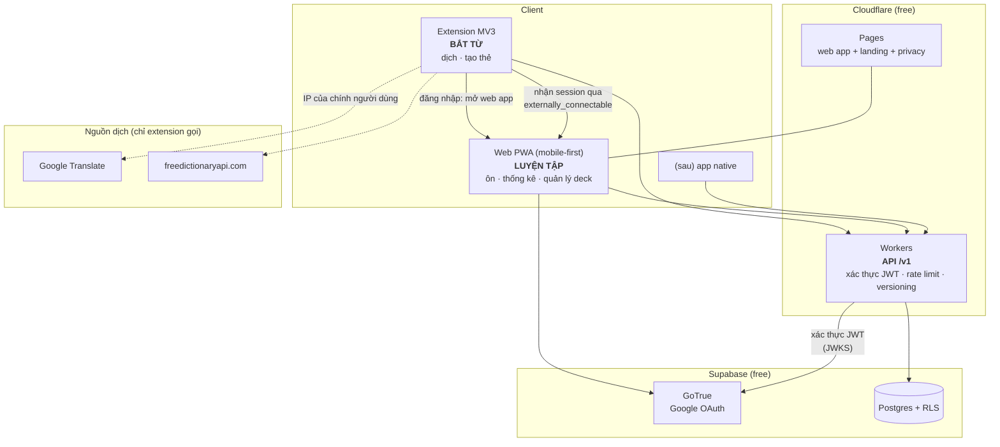

# Remember — Nền tảng đa client: API + Web luyện tập + Google SSO

> Thay thế quyết định "không có API" (ADR-11) bằng ADR-13. Đồng bộ & schema: [SYNC.md](SYNC.md).
> ⚠️ Số liệu free-tier tại 2026-09; kiểm lại trước khi chốt.

---

## 1. Hình dạng hệ thống



**Phân vai dứt khoát:**

| | Extension | Web PWA |
|---|---|---|
| Bắt từ **trong ngữ cảnh trang** (bôi đen, câu ngữ cảnh) | ✅ **chỉ ở đây** | ❌ |
| Tra từ thủ công + tạo thẻ | ✅ | ✅ |
| Ôn tập, thống kê, deck | (mini-session) | ✅ **chính ở đây** |
| Đăng nhập | uỷ quyền cho web | ✅ nơi duy nhất chạy OAuth |
| Gọi API dịch bên ngoài | ✅ | ✅ (trực tiếp, đã kiểm chứng CORS — §2) |

---

## 2. Web app tra từ trực tiếp — đã kiểm chứng CORS

> **Sửa lại**: bản trước của mục này khẳng định web app *không* gọi được API dịch vì CORS, và
> kết luận phải proxy qua Worker. **Tiền đề đó sai.** Đo bằng `curl` kèm header `Origin`
> (2026-09-01):

```
translate.googleapis.com/translate_a/single  →  Access-Control-Allow-Origin: *
  (preflight OPTIONS cũng 200 + ACAO: *)
freedictionaryapi.com/api/v1/entries/en/...  →  access-control-allow-origin: <origin>
translate.google.com/translate_tts           →  KHÔNG có CORS header, Content-Type: audio/mpeg
```

**Kết luận:** web app gọi trực tiếp được cả hai endpoint tra từ. Không cần proxy, và điều đó
**giữ nguyên ADR-12**: mỗi người dùng vẫn gọi bằng IP của chính họ, không có một IP tập trung để
Google chặn cả hệ thống.

`translate_tts` tuy không có CORS header nhưng vẫn **phát được**: `<audio src>` và `new Audio()` là
request *no-CORS*, trình duyệt cho phát mà chỉ chặn JS đọc nội dung — mà mình không cần đọc.
Nên giọng nữ của Google dùng được cả ở extension và web app.

**Điều duy nhất phải giữ:** cả hai endpoint của Google đều **không chính thức** (ADR-10) — không
key, không quota công bố, có thể chặn hoặc đổi format bất kỳ lúc nào. Vì vậy web app cũng phải có
fallback chain (`freedictionaryapi.com`), cache 90 ngày, và lỗi tra từ là **lỗi mềm** không được
làm chết luồng học.

**Phân vai vẫn giữ, nhưng vì lý do khác:** extension mạnh ở chỗ bắt từ *trong ngữ cảnh đang đọc*
(bôi đen, câu ngữ cảnh, highlight); web app mạnh ở chỗ ôn tập trên điện thoại. Đó là phân vai theo
**tình huống sử dụng**, không phải theo giới hạn kỹ thuật.

---

## 3. Chọn nền tảng — Vercel (ADR-24)

| Lớp | Chọn | Hạn mức Hobby (2026-09) |
|---|---|---|
| **Frontend + Backend** | **Next.js App Router trên Vercel** — một project, route handlers là backend | 1M function invocation · 1M edge request · 100GB băng thông · 6.000 phút build /tháng |
| **DB + Auth** | Supabase free, **region Singapore** | 500MB · 50k MAU · pause sau 7 ngày |
| Extension | vẫn MV3 vanilla, gọi cùng `/api/v1` bằng Bearer token | — |

⚠️ **Vercel Hobby cấm dùng thương mại.** Hợp lệ vì dùng cá nhân; nếu sau này thu phí thì Pro
20 USD/tháng, hoặc chuyển route handler sang Cloudflare Workers (chúng viết mỏng nên chuyển được).

**Đã loại:** Cloudflare Workers + Hono (2 lần deploy, phải cấu hình CORS cho web) ·
Next.js trên Cloudflare qua OpenNext (adapter đổi thường xuyên) · Deno Deploy · Render (cold start ~50s).

### Region — chỗ sẽ cắn nếu bỏ qua (ADR-27)

Vercel Function mặc định chạy ở **`iad1` (Washington DC)**. Nếu Supabase ở Singapore:

```
mỗi lượt chấm điểm:  VN → US (~200ms) → SG (~230ms) → US → VN  ≈ 800ms
```

Ôn 50 thẻ là chờ gần một phút. **Sửa:** đặt cả hai ở Singapore.

```json
// vercel.json
{ "regions": ["sin1"] }
```

Hobby chỉ cho **một** region nhưng được chọn region đó.
⚠️ **Region của Supabase không đổi được sau khi tạo project** — chọn sai phải tạo lại.

Sau khi sửa: VN→SG ~30–50ms, SG→SG ~5ms ⇒ **~100ms/lượt**.

**Cold start** ~200–500ms cho lượt gọi đầu sau khi function ngủ. Giảm bằng cách gọi `/api/v1/me`
ngay khi mở màn ôn tập (đằng nào cũng cần lấy hạn mức ngày).

### Ngân sách thực tế

50 thẻ/ngày = 1 queue + 50 answer ⇒ ~1.500 invocation/tháng, trên hạn mức 1M. Không chạm tới.

---

## 4. API `/v1` — đường duy nhất tới DB (ADR-21)

```
                 ┌─ Vercel Edge (CDN) ── static: JS, CSS, RSC payload
Trình duyệt ────►│
                 └─ /api/v1/*  ── Vercel Function (Node, sin1)
                                    │ env server-only: SUPABASE_URL, ANON_KEY, SERVICE_ROLE
                                    ▼
                                 Supabase (Singapore) — Postgres + RLS + GoTrue

Extension ──────► https://<app>.vercel.app/api/v1/*   (Bearer token + CORS allowlist)
```

**Tách frontend/backend được cưỡng chế bởi build, không phải bằng quy ước thư mục:**

```
apps/web/
├── app/
│   ├── (app)/          FRONTEND — client components
│   └── api/v1/         BACKEND — chỉ chạy server
├── lib/
│   ├── domain/*.ts     DÙNG CHUNG: FSRS, bậc độ nhớ, dedupe (thuần, không I/O)
│   ├── server/*.ts     CHỈ server  ← `import 'server-only'` ⇒ client chạm vào là BUILD FAIL
│   └── client/*.ts     CHỈ client  ← fetch('/api/v1/…')
└── vercel.json         { "regions": ["sin1"] }
```

1. `import 'server-only'` → build fail nếu client component import, không phải lỗi lúc chạy
2. Env **không** có tiền tố `NEXT_PUBLIC_` → Next.js không inline vào bundle client
3. Route handler không bao giờ được client code import — chúng chỉ là HTTP endpoint

**Auth hai chế độ (ADR-25):** web dùng **httpOnly cookie** do `/api/v1/auth/callback` đặt ⇒ browser
không cần anon key, không giữ token ở localStorage. Extension dùng **Bearer token** vì cookie không
gửi được từ origin `chrome-extension://`. Backend nhận cả hai: cookie trước, rồi Bearer.

**Điều quan trọng nhất:** client **không còn biết `anon` key**. Nó là env server-only của Vercel.
PostgREST public nhưng không gọi được nếu thiếu header `apikey` ⇒ backend là chốt thật, không phải
lớp trang trí. Đây là cách đúng để "che kết nối DB" trong một extension công khai: không giấu key,
mà bỏ nhu cầu client có key.

**Route handler chuyển tiếp JWT của user** tới PostgREST (ADR-22) ⇒ RLS vẫn có hiệu lực làm lớp thứ hai:
Worker quên `where user_id` thì RLS chặn, không rò dữ liệu. `service_role` chỉ dùng cho việc bắt
buộc phải vượt RLS (xoá tài khoản, job dọn).

### Bề mặt API

| Endpoint | Dùng bởi | Việc |
|---|---|---|
| `GET  /v1/me` | cả hai | profile, `serverSchema`, hạn mức còn lại hôm nay |
| `GET  /v1/decks` · `POST /v1/decks` | cả hai | danh sách / tạo deck |
| `PATCH /v1/decks/{id}` | web | đổi tên deck; trùng tên deck khác trả `409` (khác `POST` — ở đó trùng tên nghĩa là "mở deck sẵn có") |
| `DELETE /v1/decks/{id}?cards=move\|delete` | web | xoá mềm deck. `move` (mặc định) dồn thẻ sang deck khác — deck cuối cùng thì thẻ về nhóm "không có deck"; `delete` xoá mềm cả thẻ |
| `GET  /v1/decks/{id}/cards?q=&limit=&offset=` | web | thẻ trong deck để quản lý: có phân trang, tìm theo từ **và** theo nghĩa, và **thấy cả thẻ bị treo** (khác `study/queue`). `{id}` = `none` là nhóm "không có deck" |
| **`POST /v1/cards`** | **extension khi lưu từ** · web khi tra hoặc gõ tay | tạo/upsert thẻ theo `id` do client sinh ⇒ **idempotent**; dedupe ở server, trùng thì trả `409` kèm deck đang chứa |
| `PATCH /v1/cards/{id}` | web | sửa thẻ. Chỉ field CÓ MẶT trong body bị ghi (`null` = xoá giá trị); đổi `front`/`pos`/`back` là đổi khoá dedupe nên có thể trả `409` |
| `DELETE /v1/cards/{id}` | web | xoá **mềm**: giữ `card_states` + `review_logs`, và không chặn việc lưu lại đúng từ đó về sau |
| `POST /v1/cards/batch` | extension flush outbox | tối đa 200 thẻ/lần |
| `GET  /v1/study/queue?deck=&limit=` | web | hàng đợi phiên: `cards ⨝ card_states`, đã áp day cutoff + hạn mức ngày |
| **`POST /v1/study/answer`** | web | nhận `{cardId, rating, answeredAt}` → **server tính FSRS** (ADR-26) → ghi `card_states` + `review_logs` trong một transaction |
| `GET  /v1/stats` | web | tổng hợp bằng SQL, không tải thẻ về |
| `POST /v1/import` · `GET /v1/export` | cả hai | sao lưu, nhận thẻ từ extension |
| `POST /v1/account/delete` | web | FR-E4 |
| `GET  /v1/health` | cron | keepalive (ADR-20: pause = app chết) |

Không có endpoint nào trả về `anon key`, `service_role`, hay cho phép SQL tuỳ ý.

### Luồng "lưu từ" ở extension

```
Bôi đen → tra (client tự gọi Google/freedictionary, KHÔNG qua API — ADR-12)
   ↓ bấm ＋ Lưu thẻ
Ghi local trước (IndexedDB)          ← luôn thành công, kể cả offline
   ↓
Đã đăng nhập?
 ├─ chưa → dừng ở local. Hiện "chưa đăng nhập · chỉ lưu trên máy"
 └─ rồi  → POST /v1/cards
            ├─ 200/201 → đánh dấu synced
            ├─ 409     → "thẻ đã có sẵn trong deck X"
            └─ lỗi mạng/5xx → vào `outbox`, retry backoff + khi mở lại extension
```

Extension **giữ local-first** (ADR-20): bắt từ không được thất bại vì mất mạng. Nhưng outbox ở đây
nhỏ hơn sync engine rất nhiều — chỉ một chiều **đẩy lên**, không cần pull, không cursor, không
tombstone, không merge. Thẻ tạo ở web thì extension không cần biết.

Web app **không có outbox** (ADR-20): mất mạng là hiện màn "cần kết nối".

### Xác thực trên 3 nơi

| | Cách lấy token |
|---|---|
| Web app | Google SSO qua GoTrue (§6.2) |
| Extension | mở tab web app → web app đẩy session qua `externally_connectable` (§6.3, ADR-15) |
| Cả hai | tự refresh với GoTrue; Worker chỉ **xác thực** JWT, không cấp |

### Ngân sách request

Workers free **100k/ngày cho toàn bộ user**. Một phiên 50 thẻ = 1 queue + 50 answer + 1 stats ≈ 52
request. Dùng cá nhân thì không chạm tới. Nếu về sau cần: gộp nhiều `answer` thành một batch
(client giữ 5–10 lượt rồi đẩy) — nhưng **chỉ làm khi thật cần**, vì gộp là mở lại cánh cửa mất dữ
liệu mà ADR-20 vừa đóng.

**CORS:** web app **cùng origin** với API nên không cần CORS. Chỉ các route mà extension gọi mới
cần header CORS, whitelist tường minh `chrome-extension://<id>` — không dùng `*` (API mang JWT).

---

## 5. Rate limit — giờ mới làm được ở biên

Đây là thứ `002_quota.sql` **không** làm được (request vẫn chạm DB mới bị chặn).

| Lớp | Công cụ | Chặn |
|---|---|---|
| Cloudflare **Rate Limiting Rules** (free có 1 rule) | theo IP, cấu hình trên dashboard | flood thô, không cần code |
| Worker: token bucket theo `sub` (user id) trong **D1** (free: 100k write/ngày) | 60 req/phút/user | user/lỗi client gây vòng lặp |
| Postgres `charge_quota()` | 30 push/phút · 20k dòng/ngày | lớp cuối, không vòng qua được |

Không dùng Workers KV cho rate limit: free chỉ **1.000 write/ngày** — hết trong vài phút.

---

## 6. Google SSO cho 3 client

### 6.1 Cài đặt một lần
1. Google Cloud Console → OAuth client (Web application), redirect URI:
   `https://<project>.supabase.co/auth/v1/callback`
2. Supabase → Auth → Providers → Google: dán Client ID + Secret
3. Supabase → Auth → URL Configuration → Redirect URLs: thêm
   `https://<app>.pages.dev/auth/callback` và `https://<ext-id>.chromiumapp.org/`

⚠️ **Bẫy 100 user:** OAuth consent screen ở trạng thái **Testing** chỉ cho **100 user**.
Phải **Publish to production**. Với scope cơ bản (`openid`, `email`, `profile`) thì **không cần
Google review** — chỉ khi xin scope nhạy cảm (Drive, Gmail…) mới phải verify. Đừng xin scope
không cần.

### 6.2 Web PWA — luồng chuẩn
```
Bấm "Đăng nhập Google" → GoTrue authorize → Google → callback về /auth/callback
→ web app có access_token + refresh_token → lưu trong IndexedDB/localStorage
```

### 6.3 Extension — KHÔNG tự chạy OAuth
Extension mở tab web app, người dùng đăng nhập ở đó, web app **đẩy session sang extension**:

```
manifest.json:
  "externally_connectable": { "matches": ["https://<app>.pages.dev/*"] }

Web app (sau khi đăng nhập):
  chrome.runtime.sendMessage(EXT_ID, { type: 'SESSION', refreshToken })

Extension: nhận -> tự refresh -> lưu (SYNC.md §3.2)
```

Vì sao không dùng `chrome.identity.launchWebAuthFlow`: nó phụ thuộc
`https://<extension-id>.chromiumapp.org/`, mà **extension-id đổi theo cách đóng gói** ⇒ dev,
unpacked và bản store là ba id khác nhau, phải khai cả ba. Dùng web app làm **bề mặt xác thực duy
nhất** thì chỉ có một luồng OAuth để bảo trì. Vẫn khai `chromiumapp.org` làm đường lùi.

### 6.4 Mobile
**PWA, không native.** Web app mobile-first + service worker + manifest ⇒ cài được vào home screen,
0đ, không phí store, không review.

Giới hạn thật của PWA trên iOS: push notification chỉ có từ **iOS 16.4+** và **chỉ khi đã cài vào
home screen**; storage có thể bị dọn nếu không dùng lâu ⇒ gọi `navigator.storage.persist()` và
**đừng coi IndexedDB trên iOS là nơi lưu duy nhất** — đó là lý do nữa để sync không phải tuỳ chọn
đối với web app (khác với extension, nơi local-only vẫn dùng được).

---

## 7. Web app luyện tập — phạm vi

| Có | Không có (ở extension) |
|---|---|
| Phiên ôn FSRS: Text · Typing · Audio (Web Speech API) · Playback | bắt từ / dịch |
| Deck: tạo, đổi tên, chuyển thẻ, xoá | highlight in-page |
| Sửa thẻ, tìm kiếm, import/export | |
| Thống kê, streak, heatmap (REQUIREMENTS §D) | |
| ~~Offline-first~~ → **server-authoritative** (ADR-20): mất mạng hiện màn "cần kết nối" | |

### Stack & deploy

| Phần | Chọn | Deploy |
|---|---|---|
| Web app | **Vite + React SPA (static, KHÔNG SSR)** + Tailwind + `vite-plugin-pwa` | `vite build` → `wrangler pages deploy apps/web/dist` |
| API | **Hono** trên Workers | `wrangler deploy` |
| Landing + privacy | HTML tĩnh (hoặc Astro) trong cùng project Pages | cùng lệnh |

**Vì sao không SSR (Next.js / SvelteKit SSR / Remix):** toàn bộ dữ liệu là của riêng từng user và
nằm sau đăng nhập, lấy từ API `/v1` ở phía client ⇒ SSR **không có gì để render sẵn**, chỉ thêm
adapter, thêm runtime, thêm hydration mismatch.
SEO không áp dụng cho trang sau đăng nhập. Next.js dễ deploy **trên Vercel**, nhưng Vercel Hobby
cấm dùng thương mại (§3) ⇒ mất đúng lý do chọn nó.

SvelteKit + `adapter-cloudflare` cũng một lệnh và mượt thật — chọn nếu quen Svelte hơn React.

**Lợi ích cộng thêm:** extension đã dùng Vite (`@crxjs`) ⇒ cùng build tool, cùng cấu hình TS, cùng
cách import `packages/domain`. Không bảo trì hai hệ build cho 3 client.

**Hai bẫy phải biết trước:**
1. **SPA routing:** cần `apps/web/public/_redirects` chứa `/* /index.html 200`, nếu không F5 ở
   `/study` trả 404.
2. **Monorepo trên Pages:** phải set Root directory + build command trỏ đúng workspace; mặc định
   Pages build ở gốc repo và không thấy `apps/web`.

Dùng chung `packages/domain` với extension ⇒ **thuật toán FSRS và quy tắc merge chỉ tồn tại một
bản**. Đây là lúc monorepo (ARCHITECTURE §3.3) chuyển từ "nên có" thành "bắt buộc".

```
apps/
├── extension/   MV3 - bắt từ
├── web/         React PWA - luyện tập      → Cloudflare Pages
└── api/         Cloudflare Worker - /v1    → Cloudflare Workers
packages/
├── domain/      FSRS · merge · dedupe · normalize   (dùng bởi cả 3)
├── data/        Dexie schema + outbox + tombstones  (extension + web)
└── ui/          design system dùng chung
```

---

## 8. Đường đi từ trạng thái hiện tại

**Đang có (2026-09-02):** extension v0.7.0 (vanilla JS, `chrome.storage.local`, tra từ + deck +
export) · web app v0.1 (Vite/React PWA, Dexie, FSRS + hàng đợi kiểu Anki + bậc độ nhớ + tra từ,
local-only) · schema SQL đã viết · chưa có Supabase project, chưa có API.

| # | Bước | Chặn cái gì | Cần gì từ bạn |
|---|---|---|---|
| 1 | Tạo project Supabase, chạy `001_init.sql`, **tắt đăng ký công khai**, bật Google/OTP | tất cả | ✋ chỉ bạn làm được |
| 2 | `apps/api`: Hono trên Workers — xác thực JWT (JWKS), chuyển tiếp JWT tới PostgREST, 10 endpoint ở §4, CORS whitelist | mọi thứ phía sau | Cloudflare account để deploy |
| 3 | Web app: bỏ Dexie → `api.js`; thêm màn đăng nhập + màn "cần kết nối"; hàng đợi lấy từ server | web dùng thật được | — |
| 4 | Extension: nhận session qua `externally_connectable`; `POST /v1/cards` khi lưu; `outbox` + retry | thẻ chảy từ extension sang web | — |
| 5 | Cron `keepalive()` mỗi ngày (GitHub Actions) | **app chết sau 7 ngày nghỉ** (ADR-20) | — |
| 6 | Deploy web lên Pages; privacy policy | dùng trên điện thoại thật | — |
| 7 | Test: 2 thiết bị, ghi lỗi giữa phiên, token hết hạn giữa phiên, user A gửi `id` thẻ của user B | đúng đắn & bảo mật | — |

**Không còn cần** (so với lộ trình cũ): chuyển web sang Dexie + outbox + tombstone + cursor + merge
engine. ADR-20/21 xoá hẳn nhánh việc đó — đây là phần tiết kiệm lớn nhất.

**Việc lớn nhất giờ là bước 2–3**, không phải bước 1.

## 9. Biến thể "dùng cá nhân, repo công khai"

Phần lớn §3–§5 tồn tại để chịu tải. Dùng cá nhân (1–5 người) thì **bỏ đi phần lớn**, và điều đó
đúng chứ không phải cắt góc.

### Bỏ / giữ

| Thành phần | Cá nhân | Vì sao |
|---|---|---|
| **API `/v1` trên Workers** | ✅ **giữ** (ADR-21 thay thế ADR-18) | Không phải vì quy mô, mà vì **`anon` key không được nằm trong extension công khai**. Có API thì client không cần key nào cả. Đây cũng là chỗ duy nhất rate-limit được, và là cách đổi schema mà không phải ship extension |
| `002_quota.sql` | ❌ bỏ | rate-limit chính mình thì vô nghĩa; và với ADR-21 thì client không chạm được DB nên phần revoke của nó không còn cần thiết |
| Captcha ở Auth | ❌ bỏ | thay bằng **tắt đăng ký** (xem dưới) — mạnh hơn |
| Publish OAuth consent screen | ❌ bỏ | để **Testing** + thêm email của bạn làm test user; trần 100 user không ảnh hưởng |
| Phần siết quyền `anon` ở cuối `001_init.sql` | ✅ **giữ** | phòng thủ nhiều lớp: nếu `anon` key lỡ lọt ra hoặc sau này bỏ Worker thì vẫn không ghi được gì |
| Cron `keepalive()` | ✅ giữ | Supabase vẫn pause sau 7 ngày dù chỉ một người dùng |
| `remote.js` là điểm ghép duy nhất | ✅ giữ | rẻ; là cách thêm API sau này mà không làm lại kiến trúc |
| Web PWA + Google SSO | ✅ giữ | đây là thứ bạn muốn, và nó không tốn gì |

### Bảo mật khi repo công khai

1. **Tắt đăng ký:** Supabase → Auth → **Disable new user signups**, rồi tự tạo user. Không ai đăng
   ký được thì bề mặt tấn công ≈ 0. **Một cái toggle thay cho cả `002_quota.sql` + captcha.**
2. **Với ADR-21, `anon` key KHÔNG còn nằm trong repo hay trong client** — nó là
   `wrangler secret` của Worker. Đây là thay đổi lớn nhất về bảo mật so với thiết kế cũ.
3. **Không bao giờ commit `service_role` key.** Cả `anon` key cũng nên là secret;
   `service_role` bỏ qua toàn bộ RLS — commit một lần là mất sạch, kể cả sau khi xoá commit
   (git history + bot đã scrape). Nếu lỡ: rotate key ngay, đừng chỉ `git rm`.
3. Vẫn bật RLS đầy đủ và chạy query kiểm tra ở cuối `001_init.sql`. Repo public nghĩa là kẻ tấn
   công đọc được **chính xác** schema của bạn.

### Deploy

| Phần | Chỗ | Lệnh / cách |
|---|---|---|
| Web PWA | **Cloudflare Pages** | nối GitHub → push là deploy. Có `_redirects` cho SPA routing |
| | GitHub Pages (thay thế) | repo public ⇒ miễn phí; **không có `_redirects`** ⇒ phải copy `index.html` → `404.html` để lách SPA routing |
| | Vercel Hobby (thay thế) | non-commercial nên **hợp lệ**; 1M edge req/tháng. Chỉ đáng chọn nếu sau này dùng Next.js |
| CI | **GitHub Actions** | repo public ⇒ **không giới hạn phút** |
| DB + Auth | Supabase free | như §3 |

Tổng chi phí: **0đ**, cộng 5 USD một lần nếu muốn đưa extension lên Chrome Web Store (không cần
nếu tự load unpacked hoặc dùng Firefox AMO).

### Khi nào quay lại kiến trúc đầy đủ
Chia sẻ cho người ngoài · mở đăng ký công khai · đưa extension lên store cho người lạ dùng.
Lúc đó bật lại theo thứ tự: `002_quota.sql` → captcha + publish consent screen → API `/v1`.

---

## 10. Chi phí thật

| Khoản | Tiền |
|---|---|
| Workers · Pages · D1 · Supabase · Google OAuth · GitHub Actions | **0đ** |
| Chrome Web Store (một lần) | **5 USD** |
| Firefox AMO · Edge Add-ons | 0đ |
| Domain `*.pages.dev` | 0đ |
| Domain riêng (khi cần thương hiệu) | ~250–350k đ/năm |

**Trần thật, theo thứ tự sẽ chạm:**
1. **Workers 100k req/ngày** ⇒ ~1.800 user (nếu gộp một endpoint như §3–4)
2. **Supabase 500MB** ⇒ ~200 user (SYNC.md §5) — **chạm trước Workers**
3. Vượt cả hai ⇒ Oracle Always Free VM tự host, hoặc bắt đầu thu phí

Nghĩa là: **DB là trần đến trước, không phải API.** Nếu phải tối ưu, tối ưu `review_logs` trước
khi tối ưu số request.

Sources: [Cloudflare Workers pricing](https://developers.cloudflare.com/workers/platform/pricing/) ·
[Deno Deploy pricing](https://docs.deno.com/deploy/manual/pricing-and-limits/) ·
[Vercel Hobby (non-commercial)](https://vercel.com/docs/plans/hobby)
